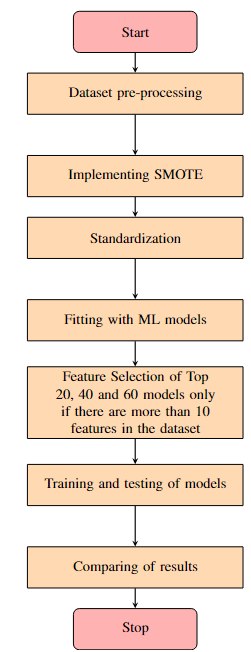
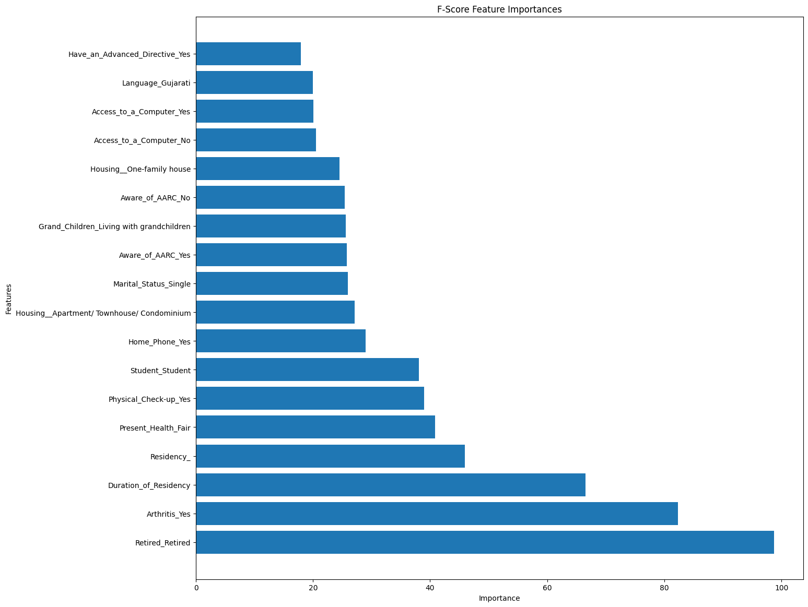
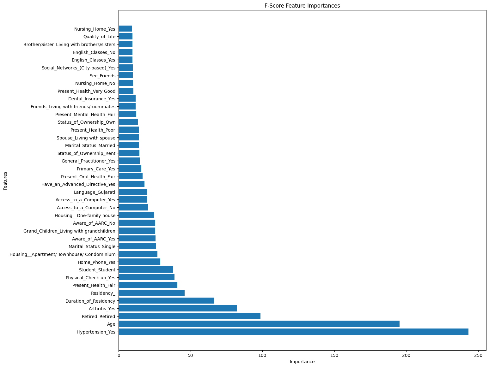
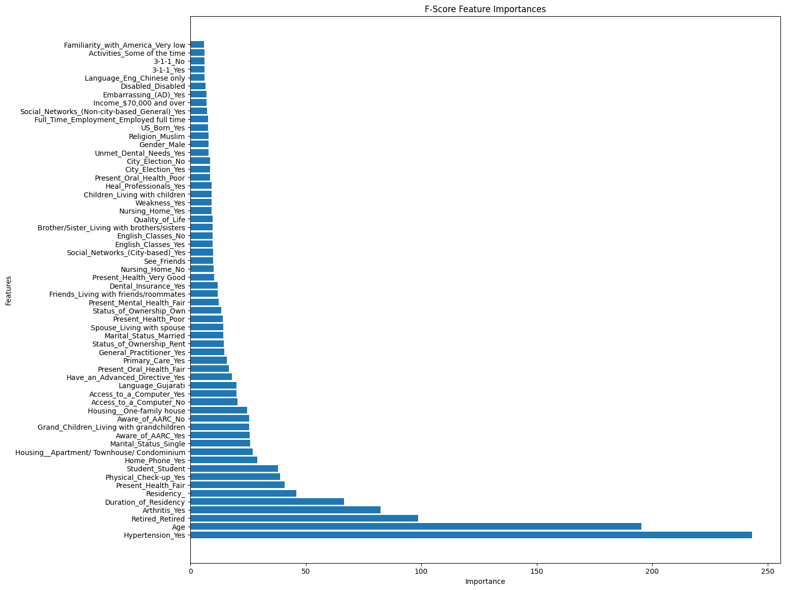

# Libraries required
1. Pandas: For data wrangling and pre-processing.
2. Numpy: For defining mathematical functions to handle skewed features.
3. Matplotlib: To visualize insights from the dataset.
4. Scikit-learn: To train, deploy and develop machine learning models.
5. Shap: To explain the predictions of our classifiers.

# Methodology and files

The following files have been uploaded to this repository:
1) Data_processing_and_EDA.ipynb : This colab notebook comprises of python scripts to preprocess and visualize insights from the AAQoL Dataset.
2) Diabetes_Prediction_Internship.ipynb: This colab notebook is the entire compilation of this research work.
3) Feature_selection_and_final_results_of_AAQoL_dataset.ipynb: This colab notebook consists of python scripts to execute and implement feature selection of top 20, 40 and 60 features on the AAQoL dataset. 
4) PID_Dataset_and_XAI.ipynb: This colab notebook consists of python scripts to validate our methodology from scratch on the PIMA Indian Diabetes Dataset. These python scripts also visualises the predictions of ML models by leveraging Explainable-AI techniques.
   
# Results

## Asian American Quality of Life (AAQoL)
The following tables discusses the accuracy, precision, recall, F1-score and specificity of the machine learning models on the AAQoL Dataset:
### Performance accuracy of the machine learning classifiers on the AAQoL dataset with top 20, 40, and 60 features, without feature standardization.
|Classifiers | All Features |Top 20 | Top 40 |Top 60|
|------------|--------------|-------|--------|------|
Decision Trees| 90.9| 85.47| 86.26| 87.88|
Logistic Regression | 50.60 | 49.27 | 49.27 | 49.44|
Naive Bayes Classifier| 53.57| 49.27| 49.27| 49.81|
Random Forests| 96 |90.82 |90.2| 91.47|
Support Vector Machine(SVM)| 49.27| 50.11| 49.27| 49.27|

### Performance accuracy of the machine learning classifiers on the AAQoL dataset with top 20, 40, and 60 features, after feature standardization.
|Classifiers| All Features| Top 20| Top 40| Top 60|
|-----------|-------------|-------|-------|-------|
|Decision Trees| 92.54| 85.47| 86.13| 87.71|
|Logistic Regression| 93.71| 77.68| 80.45| 83.75|
|Naive Bayes Classifier| 59.64| 65.98| 51.32| 51.59|
|Random Forests| 96.7| 91.02| 91.15| 92.27|
|Support Vector Machine (SVM)| 93.13| 77.81| 79.72| 83.88|

### Performance accuracy of the machine learning classifiers on the AAQoL dataset after removing redundant features.
|Classifiers| All Features| Top 20| Top 40| Top 60|
|-----------|-------------|-------|-------|-------|
|Decision Trees| 91.13| 89.84| 91.13| 90.58|
|Logistic Regression| 90.69| 83.62| 90.7| 93.35|
|Naive Bayes Classifier| 85.52| 63.62| 67.49| 71.74|
|Random Forests| 95.81| 93.78| 95.87| 95.02|
|Support Vector Machine (SVM)| 95.58| 82.02| 89.22| 93.04|

### Precision performance of the machine learning classifiers on the AAQoL dataset.
|Classifiers| All Features| Top 20| Top 40| Top 60|
|-----------|-------------|-------|-------|-------|
|Decision Trees| 90.4| 89.3| 89.6| 88.8|
|Logistic Regression| 90| 88.2| 96.4| 97.4|
|Naive Bayes Classifier| 88.9| 66.4| 68.3| 64.9|
|Random Forests| 99.7| 93.2| 98.1| 98.2|
|Support Vector Machine (SVM)| 100| 87.8| 96.7| 99.3|

### Recall performance of the machine learning classifiers on the AAQoL dataset.
|Classifiers| All Features| Top 20| Top 40| Top 60|
|-----------|-------------|-------|-------|-------|
|Decision Trees| 91.5| 90.5| 92.6| 92.5|
|Logistic Regression| 92.4| 76.9| 85.1| 88.8|
|Naive Bayes Classifier| 89.4| 87.2| 90.4| 94.3|
|Random Forests| 91.4| 93.1| 93.3| 93|
|Support Vector Machine (SVM)| 90.5| 74.1| 83.7| 86.5|

### F1 scores of the machine learning classifiers on the AAQoL dataset.
|Classifiers| All Features |Top 20 |Top 40 |Top 60|
|-----------|--------------|-------|-------|------|
|Decision Trees| 90.9| 89.9| 91.1| 90.6|
|Logistic Regression| 91.2| 82.2| 90.4| 92.9|
|Naive Bayes Classifier| 89.2| 75.4| 77.8| 77|
|Random Forests| 95.4| 93.1| 95.6| 95.5|
|Support Vector Machine (SVM)| 95| 80.4| 89.7| 92.5|

### Specificity performance of the machine learning classifiers on the AAQoL dataset.
|Classifiers| All Features| Top 20| Top 40| Top 60|
|-----------|-------------|-------|-------|-------|
|Decision Trees| 90.88| 89.84| 90.9| 90.4|
|Logistic Regression| 91.3| 83.3| 90.9| 93.2|
|Naive Bayes Classifier| 89.39| 71.65| 73.5| 71.8|
|Random Forests| 95.54| 93.1| 95.7| 95.61|
|Support Vector Machine (SVM)| 95.2| 81.9| 90.4| 92.9|

### Feature selection results for top 20 features:

### Feature selection results for top 20 features:

### Feature selection results for top 20 features:

## PIMA Indian Diabetes Dataset (PID Dataset)

The following tables discusses the accuracy, precision, recall, F1-score and specificity of the machine learning models on the PID Dataset:
### Performance Analysis on PID (Comparing Accuracy)
|Research work| Decision Trees| Logistic Regression| NB Classifier| Random Forests| SVM|
|-------------|---------------|--------------------|--------------|----------------|----|
|Proposed Study| 83.5| 83.5| 80.7| 89| 84|
|Mahmud et al| 71| 70| 74| 71| 73|
|Tigga et al| 69.7| 74.4| 68.9| 75| 74.4|
|Pranto et al| 73| NA |72| 79| NA |
|Abdelminaam et al| |64.6| 81| 81| 74.7| 81|

### Performance Analysis on PID (Comparing F1 score)
|Research work| Decision Trees| Logistic Regression| NB Classifier| Random Forests| Support Vector Machine|
|-------------|---------------|--------------------|--------------|---------------|------------------------|
|Proposed Study| 82.5| 83.2| 77.5| 89.6| 84|
|Mahmud et al| 72| 71| 74| 71| 73|
|Tigga et al| 76.2| 81.3| 83| 81.3| 81.3|
|Pranto et al| 57| NA| 57| 68| NA|
|Abdelminaam et al| 64.6| 80.7| 81| 74.5| 81|

### Performance Analysis on PID (Comparing Specificity)
|Research work| Decision Trees| Logistic Regression| NB Classifier| Random Forests| Support Vector Machine|
|-------------|---------------|--------------------|---------------|--------------|------------------------|
|Proposed Study| 83.7| 83.5| 79.5| 88.8| 84|
|Mahmud et al| 57| 61| 54| 44| 44|
|Tigga et al| 56.1| 66.6| 68.7| 66.1| 66.6|

### Performance Analysis on PID (Comparing Precision)
|Research work| Decision Trees| Logistic Regression| NB Classifier| Random Forests| Support Vector Machine|
|--------------|--------------|--------------------|---------------|--------------|-----------------------|
|Proposed Study| 80.4| 82| 85.2| 85.6| 83.2|
|Mahmud et al| 71| 70| 74| 70| 73|
|Tigga et al| 74.4| 85.6| 84| 84| 85.6|
|Pranto et al| 59| NA| 56| 68| NA|
|Abdelminaam et al| 64.6| 82.6| 81| 75.1| 81.1|

### Performance Analysis on PID (Comparing Recall)
|Research work| Decision Trees| Logistic Regression| NB Classifier| Random Forests| Support Vector Machine|
|--------------|--------------|--------------------|---------------|--------------|-----------------------|
|Proposed Study| 84.8| 84.5| 71.1| 94.1| 84.8|
|Mahmud et al| 71| 71| 74| 71| 74|
|Tigga et al| 78.1| 77.5| 82| 78.9| 77.5|
|Pranto et al| 55| NA| 58| 68| NA|
|Abdelminaam et al| 64.6| 81| 81| 74.7| 81|

### Performance Analysis on PID (Comparing ROC AUC Score)
|Research work| Decision Trees| Logistic Regression| NB Classifier| Random Forests| Support Vector Machine|
|--------------|--------------|--------------------|---------------|--------------|-----------------------|
|Proposed Study| 100| 82.6| 83.2| 100 |91.7|
|Tigga et al| 84.2| 76.5| 76| 100| 77.1|
|Pranto et al| 68 | NA| 68| 76| NA|
|Abdelminaam et al| 69.2| 88.1| 88| 83.3| 88.8|

### Feature correlation map
.png)

### Explaining model's predictions
.jpg)

.jpg)

# Contact
Reach out to girievasan.nitt@gmail.com for further enquiries.
